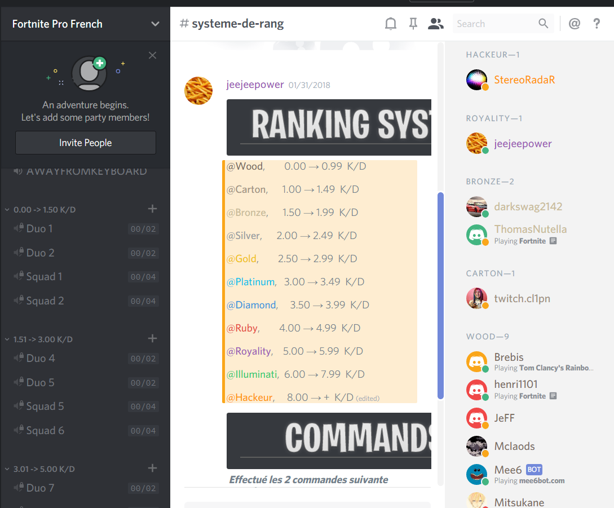

# Fortnite ranking system discord bot

## How it work?

With this script, discord users can rank themself with commands.  
Your rank depend of your overall fortnite Kill/Death ratio.
Here are the ranks you can have, __you need to create all of these ranks in your discord in order so the bot work. If you misspelled a word, errors will occur.__
```
@Wood,        0.00 → 0.99  K/D  
@Carton,      1.00 → 1.49  K/D  
@Bronze,      1.50 → 1.99  K/D  
@Silver,      2.00 → 2.49  K/D  
@Gold,        2.50 → 2.99  K/D  
@Platinum,    3.00 → 3.49  K/D  
@Diamond,     3.50 → 3.99  K/D  
@Ruby,        4.00 → 4.99  K/D  
@Royality,    5.00 → 5.99  K/D  
@Illuminati,  6.00 → 7.99  K/D  
@Hackeur,     8.00 → +  K/D  
```

Once the ranks are created you can create rooms with permissions based on the rank / K/D of the user.  
An example of a discord implementing the bot.  



## Author

Jean-Michel Poirier (poirier.jmp@gmail.com)   
Discord: Wiz#8991

## How to run?
 
__1-__ Make sure you have python3 installed on the bash you are using.  
__2-__ Install the discord library ```python3 -m pip install -U discord.py```  
__3-__ To setup the bot, open the file ```bot.py``` and modify the constant ```DISCORD_TOKEN``` with your own discord token. You can find your discord token at https://discordapp.com/developers/applications/me/   
You need to create an app then copy the token from the app.  
__4-__ To add the bot to your discord, from the app created copy your Client ID into this URL: https://discordapp.com/oauth2/authorize?&client_id=CLIENT_ID_HERE&scope=bot&permissions=470019135 and paste this URL into a web navigator.  
__5-__ (Optional) Then, modify the constant ```FORTNITE_API_KEY``` with your fornitetracker api key. You can get one at https://fortnitetracker.com/site-api  
__6-__ You are all setup to run the script, execute the command ```./script.sh```  

## What are the commands?

Once your bot is running, in a text channel you can use theses commands:  

1) ```/nick YOUR_FORNITE_USERNAME``` Change your discord username to your fortnite username.  
2) ```/rank``` Automaticly rank you according to your fortnite Kill/Death ratio.   
3) ```/patch``` Return the last patch notes of fortnite.  

## License

The project is under [Apache License 2.0](https://www.apache.org/licenses/LICENSE-2.0).  

## Bugs
- ... 
